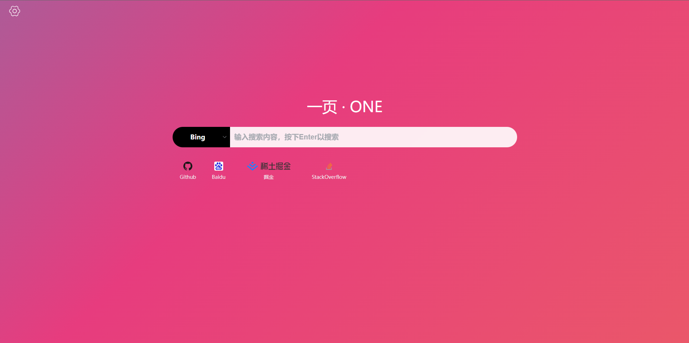
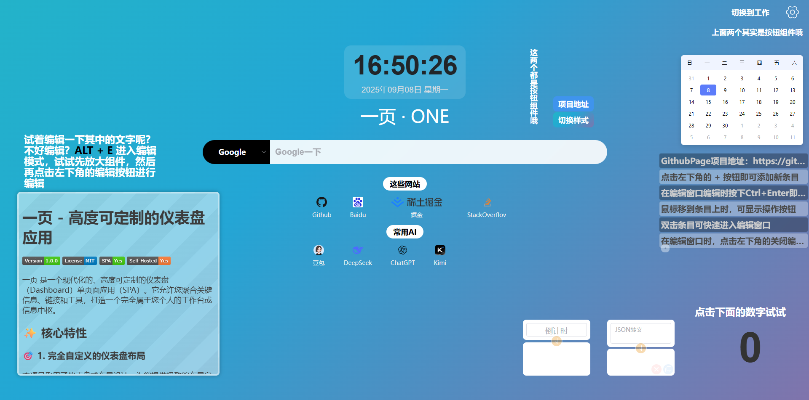

# 一页 - 高度可定制的仪表盘应用

   

一页 是一个轻量、可高度自定义的本地化起始页，专为安全、隐私和零成本部署设计。

## ✨ 核心特性

### 🎯 1. 完全自定义的仪表盘布局

本项目采用了仪表盘式布局设计，为您提供极致的布局自由度：

- **🖱️ 自由拖放定位**：每个组件都可以通过简单的拖放操作放置在页面的任意位置
- **📏 灵活尺寸调整**：所有组件支持动态调整大小，满足不同内容的展示需求
- **👀 实时预览**：所有布局调整即时可见，无需刷新页面即可查看最终效果

------

极简配置

自定义配置

------

### 🧩 2. 模块化组件设计

通过组件化架构实现高度可定制的导航体验：

- **📦 丰富组件库**：内置多种实用组件（链接卡片、搜索框、网页格子、时钟、笔记等）
- **🎨 组件自定义**：每个组件都支持独立配置，打造个性化的工作台体验

### 🎨 3. 深度样式自定义

同时支持全局样式和组件级样式的精细控制：

- **🌍 全局样式系统**：通过CSS变量定义全局主题颜色、字体、间距、动画等设计元素
- **📤 全局样式标签**：全局样式以标签的方式保存，自由组合标签来快速便捷地调整工作台风格
- **🎯 组件独立样式**：每个组件支持单独设置CSS样式，甚至于两个相同组件应用不同的样式内容

### 🌐 4. 单页面静态设计

采用现代前端技术构建的单页面应用：

- **📄 纯静态架构**：无需服务器支持，仅需浏览器即可运行
- **🐙 Github Pages友好**：完美适配Github Pages、Cloudflare Pages等静态网站托管服务

### ⚡ 5. 一键快速部署

简化部署流程，让每个人都能轻松拥有个性化导航页：

- **🔱 Fork即用**：只需Fork项目到自己的GitHub账户，无需复杂配置
- **🚀 自动部署**：开启GitHub Pages后自动构建并部署到互联网
- **🌐 自定义域名**：支持绑定自己的域名，打造专属导航门户
- **🔄 多版本管理**：通过Git进行版本控制，方便回溯和管理不同版本的配置
- **💾 自动备份**：所有配置自动保存到浏览器本地存储，防止意外丢失

### 📤 6. 便捷的配置分享

轻松分享您的精心配置，与他人共享工作台：

- **💾 完整配置导出**：一键导出所有布局、组件和样式的完整配置
- **📥 快速导入**：通过上传配置文件或输入分享链接即可复现他人工作台
- **🔍 一条链接完成分享**：在链接中加入配置方案与样式设定，直接访问即可轻松载入

------

### 快速体验不同的配置

- 试试极简页面：[Quick](https://another-homepage.pages.dev/?config=https%3A%2F%2Fcdn.jsdmirror.cn%2Fgh%2FVerlif%2Fone%40main%2Fquick-config.json&workspace=temp)
- 试试样式演示：[Introduction](https://another-homepage.pages.dev/?config=config=https%3A%2F%2Fcdn.jsdmirror.com%2Fgh%2FVerlif%2Fone%40main%2Fintroduction-config.json&workspace=temp)

*以上为临时工作区，重载页面后会被清空。*

------

### 🗂️ 7. 多工作区支持

引入多工作区概念，满足多样化场景需求：

- **🏢 独立工作区**：创建多个完全独立的工作区，每个拥有自己的布局、组件和样式
- **🎭 场景化设计**：为不同用途创建专属工作区（如工作、学习、娱乐、项目等）
- **🔄 快速切换**：一键切换不同工作区，适应不同使用场景

## 🚀 快速开始

### 直接访问网址

- GithubPage: [one](https://verlif.github.io/one)
- CloudflarePage: [another-page](https://another-homepage.pages.dev/)

### 部署自己的Page页面

1. 找到仓库地址[one](https://github.com/Verlif/one)
2. 点击`Fork`按钮，将仓库复制到您的 GitHub 账号下。
3. 进入您的仓库设置，将`gh-pages`分支设为默认分支。
4. 进入您的仓库设置，使用`gh-pages`分支作为page分支即可。

### 本地打包部署

1. Fork 或下载本项目代码。
2. 运行`npm install & npm run build`
3. 打包完成后，在项目根目录下会生成一个`dist`文件夹，将其上传到您的服务器即可。

### 高级技巧

跳转到 [高级技巧](./docs/Advanced.md)

## 🛠️ 技术栈

- **前端框架**: Vue 3
- **构建工具**: Vite
- **布局库**: Gridstack.js
- **样式库**: Element Plus

## 📜 许可证

本项目采用 [MIT](https://opensource.org/licenses/MIT) 许可证。请查看 `LICENSE` 文件了解更多详情。

## 🤝 贡献

我们欢迎任何形式的贡献！

## ⚠️ 注意事项

- 当使用 HTML 组件功能时，请仅嵌入您信任的代码，因为恶意脚本可能会带来安全风险。
- 导出的配置文件包含您的所有布局和设置，请注意在导出时隐藏您的隐私信息。
- 部署在 GitHub Pages 上时，由于是纯前端应用，所有配置和数据都存储在您的浏览器本地（LocalStorage），清空浏览器数据会导致配置丢失，请记得定期导出备份。

---

**享受打造您专属仪表盘的乐趣吧！**