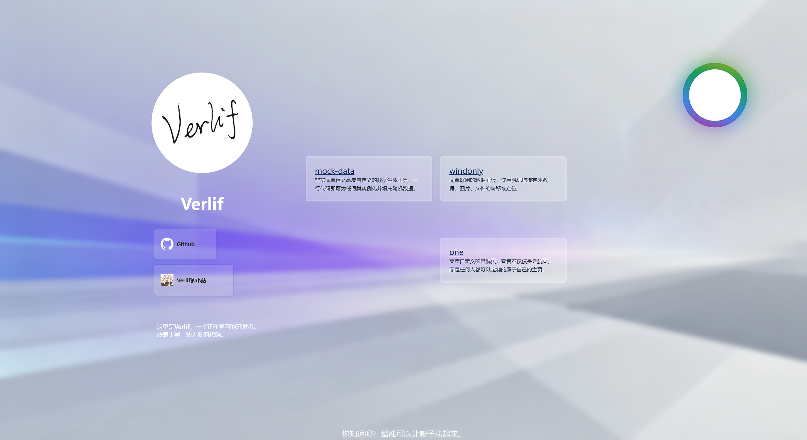
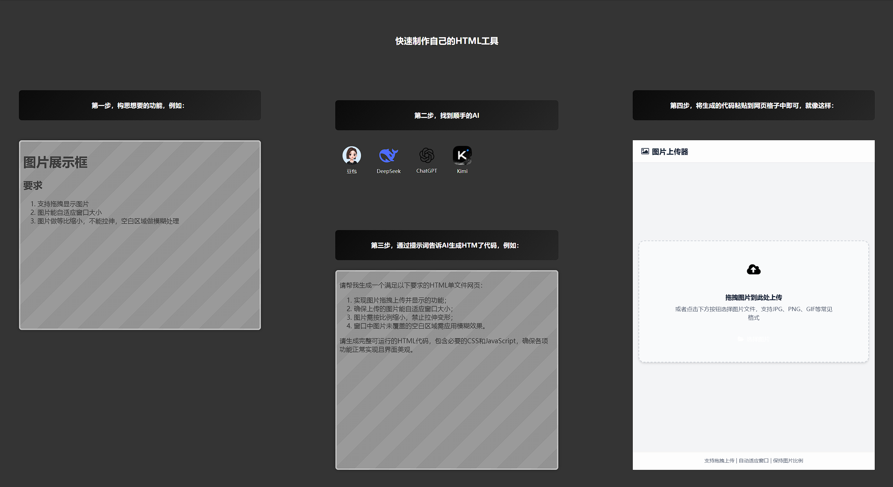
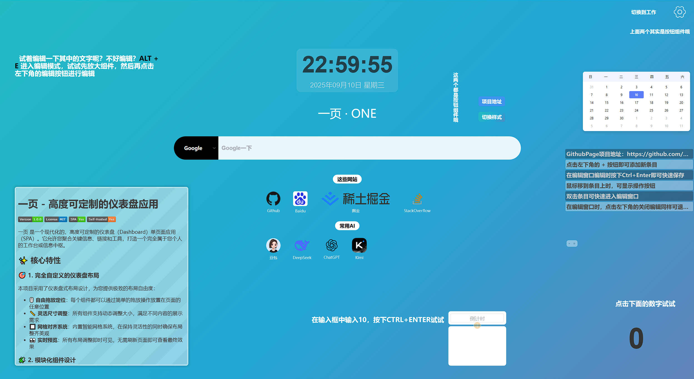

# 一页 - 高度自定义的个人主页

  

 [](https://vercel.com/verlif/one) [](https://app.netlify.com/projects/one-nav/deploys)

<center><a href="https://one.verlif.top/"></a></center>
<center><strong>一页 · ONE</strong></center>

**一页 · ONE** 是一个无服务器的纯前端主页，专为个性化和私有化设计。

不同于传统的个人主页，**一页 · ONE** 采用 **组件 + 网格** 的形式，用户可以自由组合、定制和分享自己的页面或是组件。

## 站点在线地址

以下为Page挂载地址，请根据网络环境选择访问：

- [GithubPage](http://one-page.verlif.top/)
- [Cloudflare](https://one.verlif.top/)
- [Netlify](https://one-nav.netlify.app/)
- [Vercel](https://vercel.one.verlif.top/)

---

## 🛠️ 你可以用它做什么？

### 网站导航


### 个人主页



### 游戏教程



### 产品介绍



---

## ✨ 特点介绍

### 🧩 自由的组件系统

- 内置 **10 个基础组件** 与 **数十个预设组件**
- 支持自由拖拽、排列组合
- 每个组件都可以 **单独修改内容和 CSS 样式**
- <details>
    <summary>
      <b>基础组件列表</b>
    </summary>
    <section>
      <li>文本格子：文本输入框，支持H5标签</li>
      <li>便签格子：markdown文本域，双击即可快速编辑</li>
      <li>搜索栏：通过自定义搜索引擎进行搜索</li>
      <li>网址格子：输入网址来在组件中直接显示网页</li>
      <li>网页格子：将网页代码放入格子中，即可在页面中显示其内容</li>
      <li>快速链接：自定义链接标签，点击打开网页</li>
      <li>按钮格子：提供可点击的按钮，自定义点击后执行脚本内容</li>
      <li>输入转换：提供输入框与输出框，通过编写转换方法自定义输出内容</li>
      <li>计算函数：自定义js脚本，支持加载时运行和双击运行两种方式</li>
      <li>记录格子：分条目的文本记录组件</li>
    </section>
  </details>

### 🎨 全局样式标签

- 用户可创建多个 **样式标签**
- 每个标签包含一段 CSS，可灵活组合使用
- 一次启用多个标签，快速切换不同主题

### 📐 灵活的网格布局

- 自定义网格数量与单元格大小
- 组件可自由排放、调整大小
- 满足不同场景的页面需求

### 🗂️ 工作区分离

- 支持定义多个工作区
- 不同工作区数据互相隔离
- 快速切换不同的使用场景（如学习 / 工作 / 展示）

### 🚀 轻量化部署

- 纯前端 **单页面应用（SPA）**
- 无需服务器，支持一键部署到：
    - GitHub Pages
    - Cloudflare Pages
    - Vercel 等平台

### 🔄 配置分享

- 任意组件都能 **导出配置** 或 **拖拽到其他网格**
- 支持分享 **单个组件** 或 **整个工作区**
- 数据复用与共享更加方便

### 🧑‍🎨 个性化组件模板

- 每个组件可保存为 **模板**
- 模板保存了内容和独立样式
- 新建时可直接使用，支持 **跨工作区复用**

---

## 📦 快速开始

```bash
# 克隆项目
git clone https://github.com/OnePageWeb/one-page.git

# 安装依赖
cd one-page
npm install

# 启动开发环境
npm run dev

# 构建生产版本
npm run build
```
