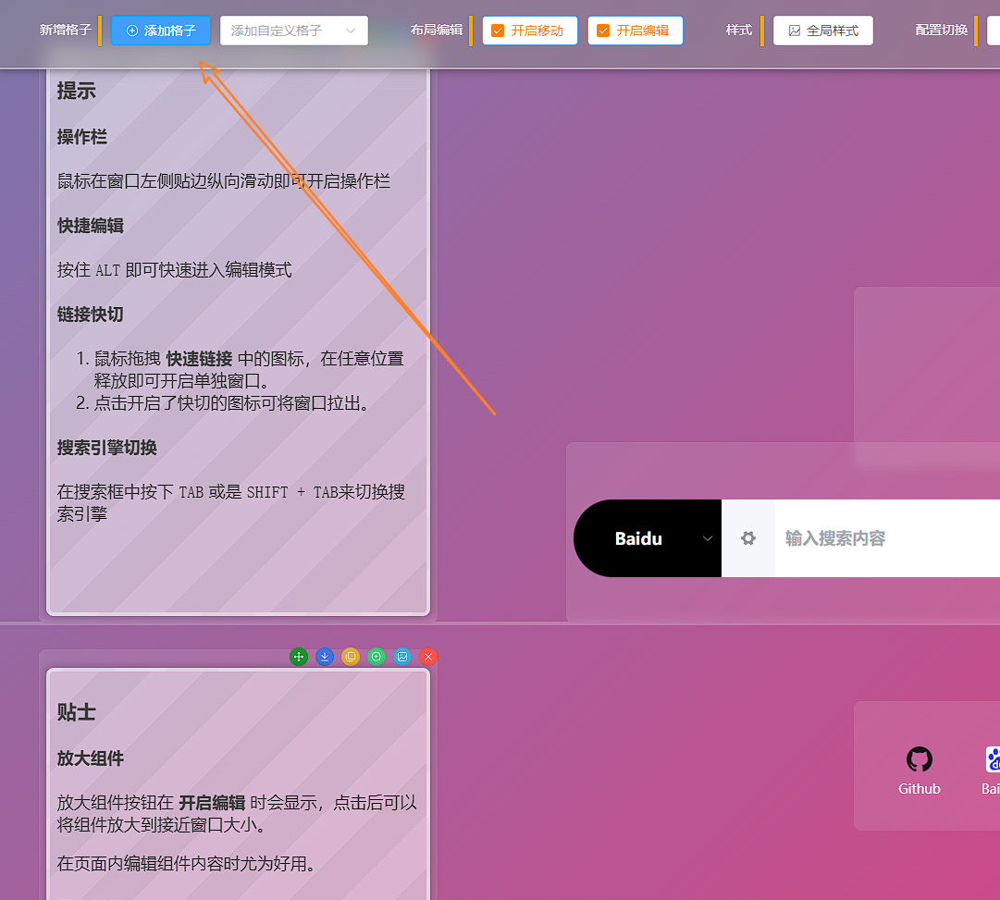
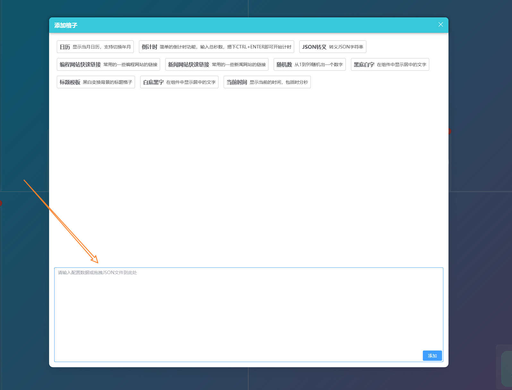
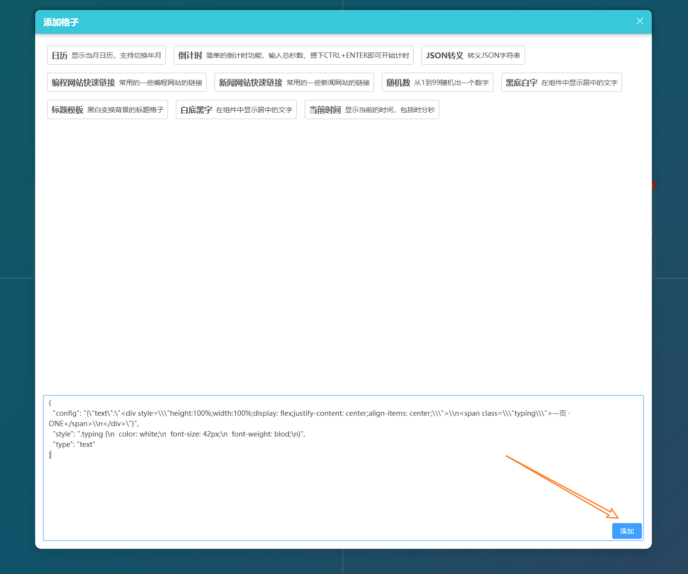

# 高级技巧

## 分享配置与加载配置

### 分享配置

详情请参考[分享配置](./ShareConfig.md)

### 加载配置

#### 常规加载配置

1. 从页面**左边缘竖向滑动**开启操作栏
2. 在操作栏中找到`加载配置`按钮，点击后展开配置弹窗
3. 在弹窗中输入配置地址或将json文件拖拽其中，点击`加载`即可加载配置

#### 地址栏加载配

通过在地址栏参数中添加`config`来设定初始工作区，例如：

```
https://blog.verlif.top/one/?config=https%3A%2F%2Fgithub.com%2FVerlif%2Fone%2Freleases%2Fdownload%2Fv0.3%2Ffirst-config.json
```

这样可以让页面在加载时加载指定的配置文件。

#### 注意

加载配置时，会覆盖当前工作区的所有内容，请注意保存或切换工作区来加载配置。

## 预加载工作区

通过在地址栏参数中添加`workspace`来设定初始工作区，例如：

```
https://blog.verlif.top/one/?workspace=my-workspace
```

这样可以让页面在加载时切换到或新增到目标工作区，而不需要手动切换。

与分享配置同时作用时，会将分享的配置加载到目标工作区中。

## 组件分享与加载

### 组件分享

组件分享并不像分享配置那样支持远端加载，仅支持文件导出与导入。

1. 开启操作模式（操作栏开启或按住ALT临时开启）
2. 在需要导出组件的操作按钮中找到`导出`按钮，点击后即可将配置下载到本地

### 组件加载

1. 点击操作栏中的 `添加格子` 按钮

    

2. 将导出的组件配置文件拖拽到下方的输入框中

    

3. 点击`添加`按钮即可将组件添加到页面中

    

4. 完成