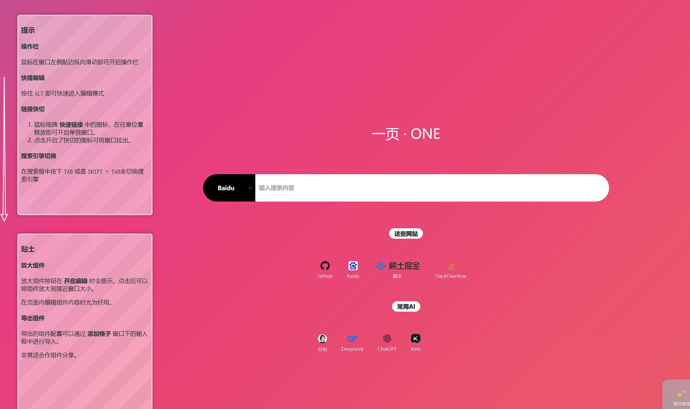
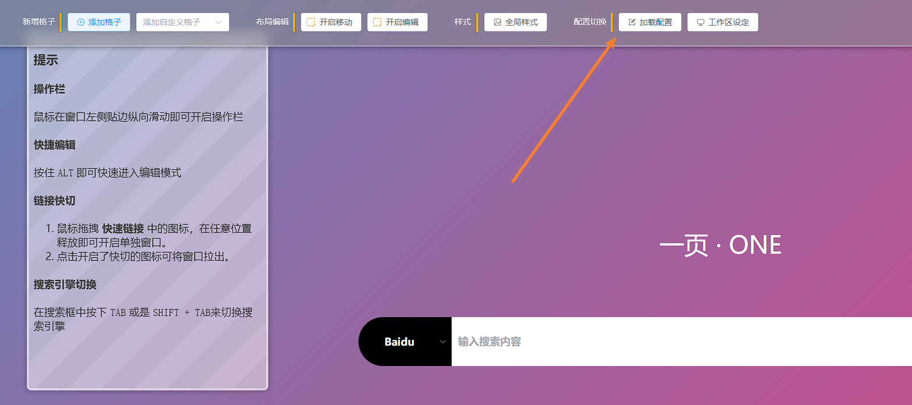
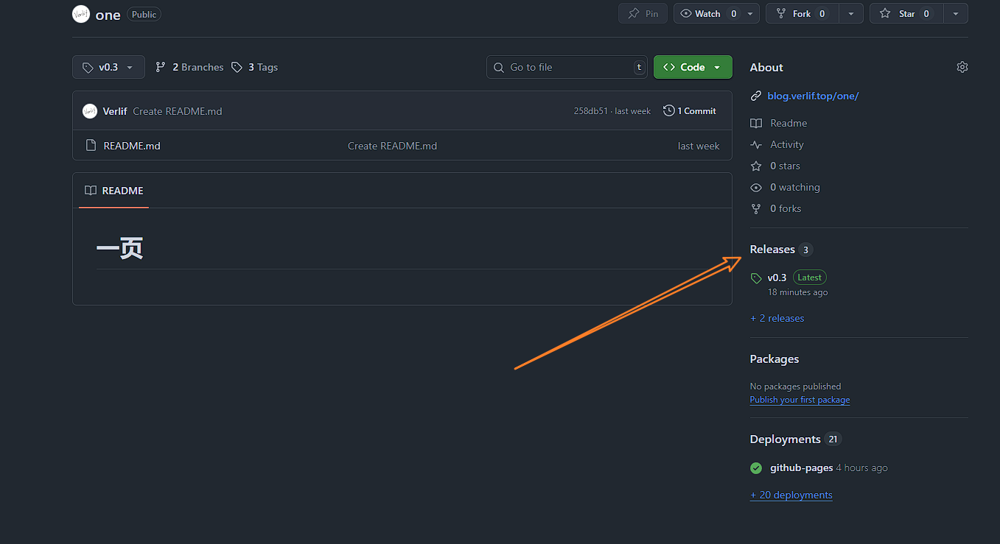
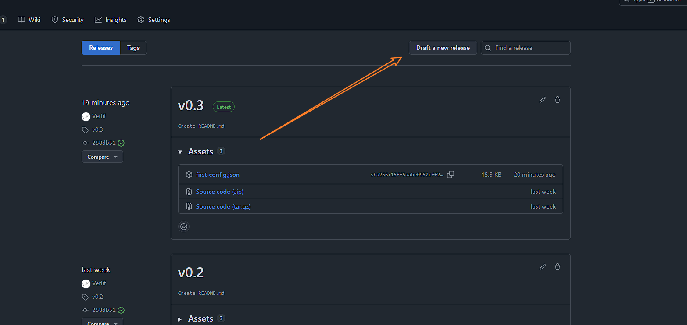
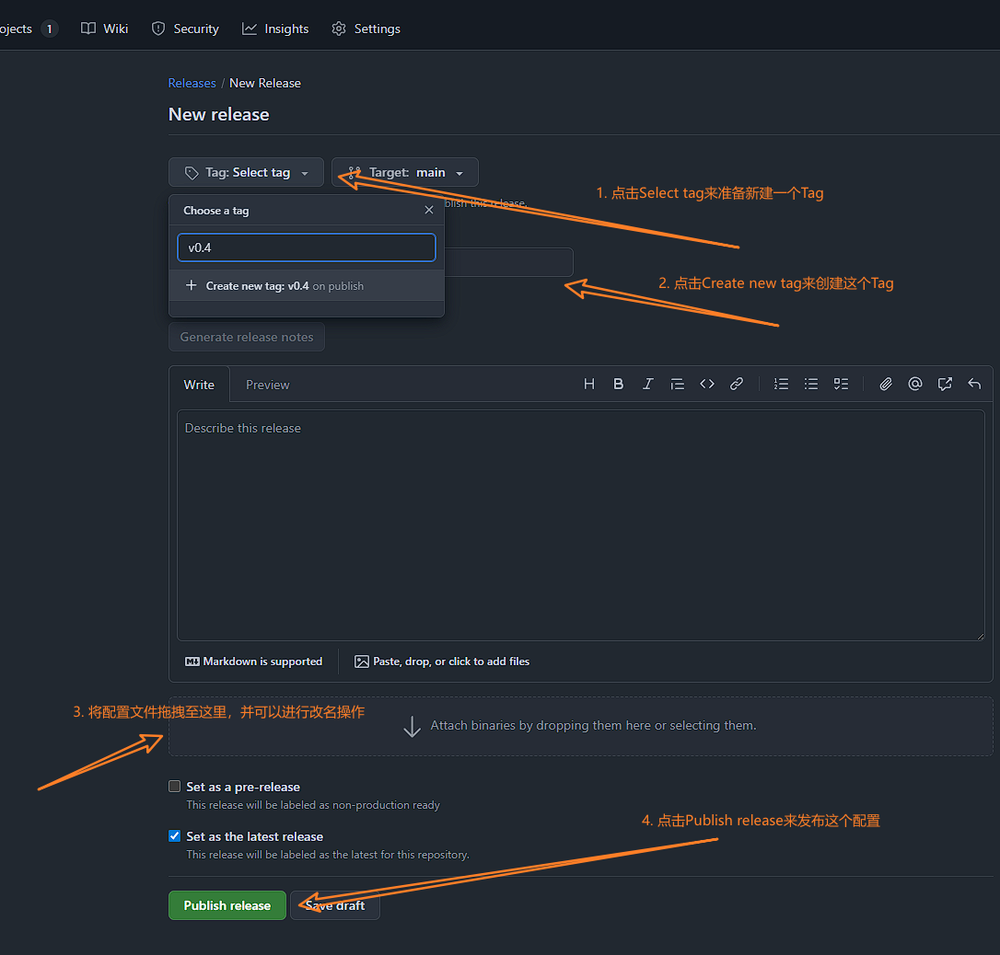
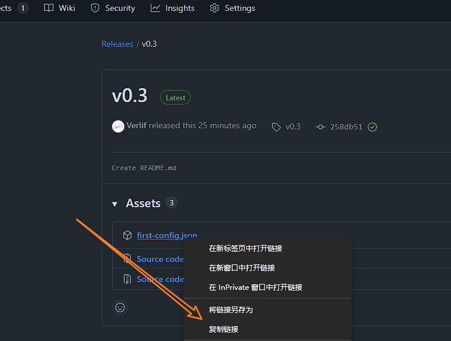

# 分享配置

## 简述

分享配置的目的是为了让其他用户可以通过一个链接来加载你的配置，而不需要自己手动配置。

简述的步骤：

1. 自定义布局
2. 导出配置
3. 上传配置
4. 生成配置地址
5. 分享配置地址

## 自定义布局

按照自己的想法进行页面布局

## 导出配置

1. 从页面**左边缘竖向滑动**开启操作栏

    

2. 在操作栏中找到`加载配置`按钮，点击后展开配置弹窗，点击下方的`下载`即可导出配置文件

    

## 上传配置

将导出的配置文件上传到公开可访问的服务器，以下以Github举例：

1. 在Github上创建一个新的公开的Repository
2. 点击右侧的Release进入Release页面

   

3. 点击`Draft a new release`创建新的Release

   

4. 创建一个新的Release

   

5. 复制Release中配置文件的URL

   

## 生成配置地址

1. 将URL进行`URL ENCODE`编码

   例如打开浏览器控制台，输入`encodeURIComponent('${url}')`，其中`${url}`为配置文件的URL，例如：

   ```
   encodeURIComponent('https://github.com/Verlif/one/releases/download/v0.3/first-config.json')
   ```

   按下ENTER，然后复制得到的字符串，例如：

   ```
   https%3A%2F%2Fgithub.com%2FVerlif%2Fone%2Freleases%2Fdownload%2Fv0.3%2Ffirst-config.json
   ```

2. 对URL进行组合

   例如：首页地址是 [http://blog.verlif.top/one/](http://blog.verlif.top/one/)，则配置地址为：

   ```
   `https://blog.verlif.top/one/?config=${url}`
   ```

   其中`${url}`为上一步得到的编码后的字符串，例如：

   ```
   https://blog.verlif.top/one/?config=https%3A%2F%2Fgithub.com%2FVerlif%2Fone%2Freleases%2Fdownload%2Fv0.3%2Ffirst-config.json
   ```

## 完成

恭喜你，可以将这个地址分享给其他好友，他们可以通过这个地址来加载你的配置了。
